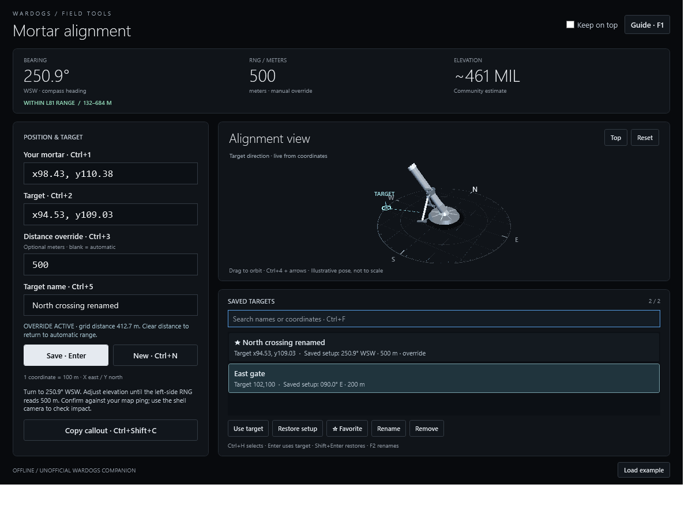

# WARDOGS Mortar Fast Calc


[Download the Windows package](https://github.com/pjourney/mortar-fast-calc/raw/refs/heads/main/WardogsFastCalc-Windows.zip)

Double-click **WardogsFastCalc.exe** in the extracted Windows package, or **dist/WardogsFastCalc.exe** in the source project. No installer, browser, account, or network connection is needed. This is a native C# / WPF desktop application for Windows 10/11 with .NET Framework 4.8 or later. It uses the framework already installed on this computer.



The screenshots use synthetic game coordinates. See the [change history](CHANGELOG.md), [validation results](tests/VALIDATION.md), and [build and maintenance guide](docs/DEVELOPMENT.md).

## Quick start

1. In WARDOGS, right-click your mortar's position on the map and choose **Mark Coordinates**. Copy its coordinate pair from the chat input.
2. Paste into **Your mortar**. Repeat for the **Target** field.
3. Leave **Distance override** blank for calculated distance, or enter your measured game distance in meters.
4. Match the app's compass bearing and **RNG** value in the game's mortar sight. The MIL value is an additional community-table estimate.
5. Optionally enter a **Target name**, then press **Enter** while editing an input to save the setup.

Try **Load example** first: `x98.43, y110.38` to `x94.53, y109.03` produces approximately **413 m**, **250.9° WSW**, and **569 MIL**.

The app automatically recalculates while typing. Invalid input clears the old result. An override is explicitly labeled and changes range and the MIL estimate; heading continues to come from the coordinate pair. **New** clears the target, distance override, and name while keeping your mortar position.

## Keyboard

| Key | Action |
| --- | --- |
| Tab / Shift+Tab | Next / previous control |
| Ctrl+1 | Select your mortar coordinates |
| Ctrl+2 | Select target coordinates |
| Ctrl+3 | Select distance override |
| Ctrl+4 | Focus the 3D view |
| Ctrl+5 | Select the optional target name |
| Enter while editing inputs | Save current setup |
| Ctrl+N | New target; retain mortar |
| Ctrl+Shift+C | Copy the result as a text callout |
| Ctrl+H | Focus saved targets |
| Up / Down, then Enter | Use selected target from your current mortar position |
| Shift+Enter in saved targets | Restore saved mortar, target, and override |
| Ctrl+F | Search saved names or coordinates |
| Down / Enter in search | Move to matching saved targets |
| Esc in search | Clear the filter |
| F2 / F in saved targets | Rename / toggle favorite |
| Delete in saved targets | Remove the selected setup |
| Ctrl+T | Toggle always on top |
| F1 | Open the in-app guide |
| Alt+F4 | Close |

Shortcuts work while the calculator has focus. Alt+Tab between the game and calculator. “Keep on top” is useful alongside a windowed/borderless game; exclusive fullscreen can cover other windows.

## Interactive 3D alignment view

The interface uses a quiet monochrome palette and a shaded 3D mortar to make the calculated alignment visible. A compass plane and target marker show the direction, while the tube becomes steeper as the community MIL value increases.

Drag the model to orbit, scroll to zoom, or press **Ctrl+4** to focus the view. Arrow keys orbit, **+ / -** zoom, **Space** switches between perspective and overhead views, and **Home** resets the camera. The Top and Reset buttons provide the same view controls. Camera movement never changes your coordinates or calculated aiming values.

The model is schematic: bearing follows the calculated compass heading exactly, but tilt is an illustrative mapping of the game's MIL table rather than a literal angle. The target ring is not a distance scale. It shows no predicted shell path, obstructions, terrain, or live game state. Missing or invalid input removes the target marker; an out-of-range target retains its bearing with an amber marker and no elevation estimate.

## Input and scope

Accepted formats include `x98.43, y110.38`, `98.43 110.38`, `98.43 / 110.38`, and `(98.43, 110.38)`. Labeled decimal commas work: `x98,43 y110,38`. Unlabeled values use decimal points, X first. Paste the coordinate pair itself, without player names or timestamps.

The pinned Bakurani, Ozeti, and Zestafona community configurations share a scale of 100 meters per coordinate unit. X increases east and Y increases north. No map selector is necessary for this coordinate-only calculation. The input envelope is 0–164 for each game coordinate; this is not a geographic latitude/longitude tool. The data was researched on September 19, 2026; the app does not download table updates. See [research and sources](RESEARCH.md).

L81 only: the researched community table covers 132–684 meters. Estimates use linear interpolation of that game's table. Outside the interval the app shows a range warning and suppresses MIL. It does not compute terrain-height, wind, or obstruction corrections. Community data may change with patches. The live game sight takes precedence; the application has not been validated by firing rounds in a live match.

## Saved targets

Add an optional **Target name** of up to 60 characters before saving. Saved rows show the name, target coordinates, and the bearing/range of the saved setup; hover a row to see the full setup, including its mortar position and override. Unnamed entries use their target coordinates as a label. The row's saved bearing/range does not change when you move your current mortar; the aiming strip shows the current calculation.

| Action | Mortar position | Target | Distance override |
| --- | --- | --- | --- |
| **Use target** — Enter or double-click a saved row | Keep current position | Load selected target | Clear and recalculate from coordinates |
| **Restore setup** — Shift+Enter in saved targets | Restore saved position | Load selected target | Restore saved override, if any |

After moving your mortar, update **Your mortar**, press **Ctrl+H**, select a saved target with the arrow keys, and press **Enter**. Use **Shift+Enter** when you deliberately want the entire earlier setup back. Both actions load the saved name; neither changes the stored setup until you save again.

Press **Ctrl+F** to search names or mortar/target coordinate text without regard to case. **Down** or **Enter** moves from search into the matching rows; **Esc** in search clears the filter. A filtered-out target has not been deleted.

**Rename** (F2) edits the selected saved name; canceling leaves it unchanged. **Favorite** (F) puts a target at the top and protects it from automatic eviction. Within favorite and non-favorite groups, the most recently saved setups appear first. At the 20-target limit, adding a setup removes the oldest non-favorite. If all 20 are favorites, remove or unstar one before adding another. **Remove** or **Delete** removes the selected setup, including a favorite.

Saving the same mortar coordinates, target coordinates, and override again refreshes that entry instead of adding a duplicate, even if coordinate formatting differs. Its favorite status is retained. Saving different coordinates or an override creates a separate setup; names need not be unique. Existing unnamed saved targets remain compatible.

## Window layout and resizing

The bearing, range, and MIL strip stays visible while the controls scroll. Below 1000 logical pixels in window width, the panels stack; wider windows put inputs beside the scene and saved list. The app supports windows down to 560 × 500 logical pixels. The scene grows with available space, and keyboard focus scrolls off-screen controls into view.

Window size, position, and maximized state are restored on launch. Saved bounds are fitted to an available monitor's work area, including when the previous monitor is disconnected. The usual minimum size is reduced if the available work area is smaller. Desktop scaling uses the app's existing Windows system-DPI-aware behavior; logical pixels are layout units, so the breakpoint is affected by display scaling.

See the [minimum-size view](tests/app-minimum-size.png), [saved targets in a narrow window](tests/app-narrow-history.png), and [short, wide layout](tests/app-short-wide.png). Physical monitor hot-plug and transitions between monitors with different DPI settings have not been validated; see the [test scope](tests/VALIDATION.md).

## Saved data

The last inputs, target name, keep-on-top preference, window placement, and up to 20 named/favorite setups are stored at:

`%LOCALAPPDATA%\WardogsFastCalc\session.xml`

Saving, renaming, favoriting, removing a setup, or closing the app writes state. Each saved setup includes its name, favorite status, mortar coordinates, target coordinates, and optional distance override. Write failures are reported in the footer; targets remain available in memory for the current session.

To back up or transfer your saved setups, close the app and copy `session.xml` to a private location. To restore a backup, close the app before replacing that file. There is no automatic backup or cloud sync. Keep personal session files out of Git and release ZIPs.

The app does not access game memory, inject inputs, monitor the clipboard, or use the network. Copy reads no clipboard contents and runs only when requested.

## Troubleshooting

| Symptom | What to check |
| --- | --- |
| A saved target disappeared from the list | Clear the search with Ctrl+F, then Esc. At the 20-target limit, old non-favorites can be replaced by newer saves. |
| A recalled target has a different range | Enter recalculates from your current mortar and clears overrides. Use Shift+Enter to restore the old setup. |
| Some controls are below the window | Scroll the controls, press Tab, or use Ctrl+1–5, Ctrl+F, and Ctrl+H. The aiming strip stays fixed. |
| The footer says the session could not be saved | Check available disk space and write access to the session folder. Keep the app open until the issue is resolved, then save again. |
| The previous session could not be read | Preserve a private copy of the existing file before closing the app, then close it and restore a known-good backup. The app cannot recover lost entries automatically. |
| Copy reports that the clipboard is busy | Wait briefly, then copy again. |

## Build and tests

From the project directory, in PowerShell, build into a staging folder so the running release is not overwritten:

```powershell
.\build.ps1 -OutputDirectory build-preview
$test = Start-Process .\build-preview\WardogsFastCalc.exe -ArgumentList '--test tests\test-results.txt' -WindowStyle Hidden -PassThru -Wait
Get-Content .\tests\test-results.txt
if ($test.ExitCode -ne 0) { throw 'Tests failed' }
```

The build uses the Windows .NET Framework C# compiler with no downloaded NuGet dependencies. The executable embeds its XAML, L81 table, and application icon. The latest recorded run passes **202 assertions**. Test mode runs calculation and WPF interaction checks, writes its report and rendered UI images, and exits with code 0 on success. Test sessions are isolated from real saved setups. See the [maintenance guide](docs/DEVELOPMENT.md) for release packaging and executable verification.

The vector icon source is `src/AppIcon.svg`. Run `src/build-icon.ps1` to regenerate the PNG and Windows ICO, which contains nine resolutions from 16 through 256 pixels. The executable includes native Windows icon resources and the window uses the same embedded asset.

Use `package.ps1` to create the Windows ZIP from an explicit file list. Never archive entire local test or build directories: they can contain private session data.

Security/privacy checks in a Git checkout: `python scripts/audit_repo.py --history` (Python 3, standard library only). See [SECURITY_AUDIT.md](SECURITY_AUDIT.md) for findings, fixes, and the limits of history cleanup. Use a project-only or privacy-protecting Git identity when contributing.

Source: [src/](src/). Tests: [tests/Tests.cs](tests/Tests.cs). Research and exact upstream commit: [RESEARCH.md](RESEARCH.md). Third-party license: [THIRD-PARTY-NOTICES.txt](THIRD-PARTY-NOTICES.txt).
